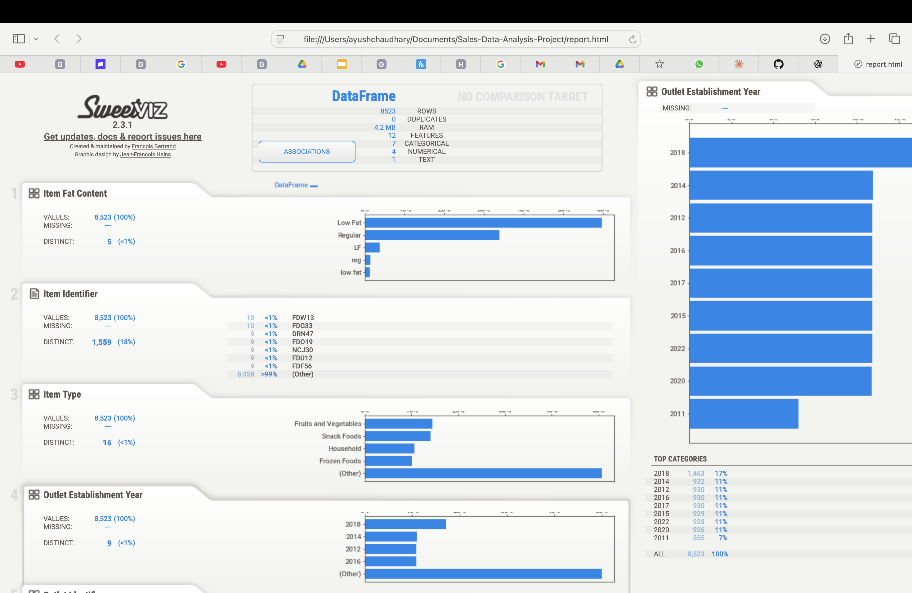
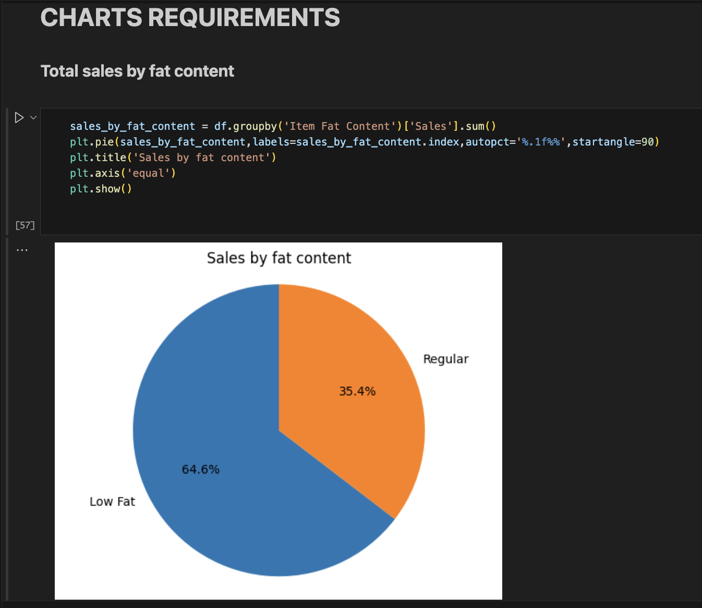

# 🛒 Blinkit Sales Data Analysis Report

## 📌 Project Overview

This project focuses on performing an end-to-end data analysis of Blinkit’s grocery dataset to uncover meaningful business insights. The goal is to analyze sales performance, customer preferences, and outlet efficiency using multiple tools including SQL, Python, and Power BI.

---

## 🎯 Objectives

* Analyze total sales and revenue distribution
* Understand customer purchasing behavior
* Identify top-performing item types
* Evaluate outlet performance across different locations and sizes
* Discover factors affecting sales (fat content, item type, outlet type)

---

## 🛠️ Tools & Technologies Used

* **Python (Pandas, Matplotlib, Seaborn, Sweetviz)** → Data cleaning, preprocessing, EDA
* **SQL** → Data querying and aggregation
* **Tableau** → Dashboard creation and visualization
* **Excel** → Initial data exploration and validation

---

## 📂 Data Preparation (Python)

* Handled missing values in columns like `Item Weight` and `Outlet Size`
* Standardized categorical values (e.g., Low Fat, Regular)
* Converted data types for accurate analysis
* Generated automated EDA report using Sweetviz

---

## 📊 Exploratory Data Analysis (EDA)

Using Python and Sweetviz:

* Analyzed distribution of sales across item types
* Checked correlation between variables
* Identified missing values and inconsistencies
* Observed trends in outlet performance

---

## 🧮 SQL Analysis

Performed structured queries to extract key insights:

* Total sales by item type
* Sales distribution by outlet type
* Average sales per outlet
* Number of items sold by category

---

## 📈 Key Insights

### 🛍️ 1. Item Type Performance

* Certain item categories contribute significantly to overall revenue
* High-demand items show consistent sales across outlets

---

### 🥗 2. Fat Content Impact

* Low Fat items have higher overall sales compared to Regular items
* Indicates customer preference toward healthier options

---

### 🏪 3. Outlet Performance

* Supermarket Type outlets generate the highest revenue
* Medium-sized outlets perform better than small ones

---

### 🌍 4. Location-Based Insights

* Tier 2 and Tier 3 cities show strong sales performance
* Expansion opportunities exist in high-performing regions

---

### 💰 5. Sales Distribution

* Sales are unevenly distributed across item types and outlets
* Few categories dominate revenue contribution

---

## 📊 Power BI Dashboard

An interactive dashboard was created to visualize:

* Total sales KPI
* Sales by item type
* Outlet-wise performance
* Filters for item type, outlet size, and location

---

## 📁 Reports & Visualizations

* Sweetviz automated EDA report (HTML)
* Python visualizations (Matplotlib & Seaborn)
* Power BI interactive dashboard
* SQL query outputs

---

## 🚀 Conclusion

This project demonstrates how data analysis can provide actionable insights into business performance. By combining SQL, Python, and Power BI, we identified key factors influencing sales and uncovered opportunities for business growth.

---

## 🏆 Key Learnings

* End-to-end data analysis workflow
* Data cleaning and preprocessing techniques
* SQL-based data extraction
* Dashboard creation in Power BI
* Storytelling with data

---

## 🔗 Future Improvements

* Add predictive modeling for sales forecasting
* Integrate real-time data pipeline
* Enhance dashboard interactivity

---
